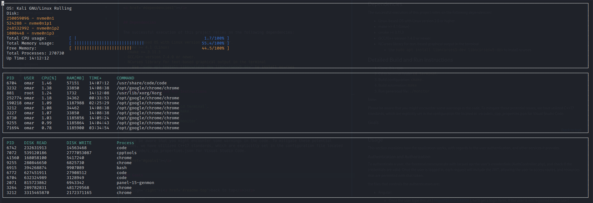
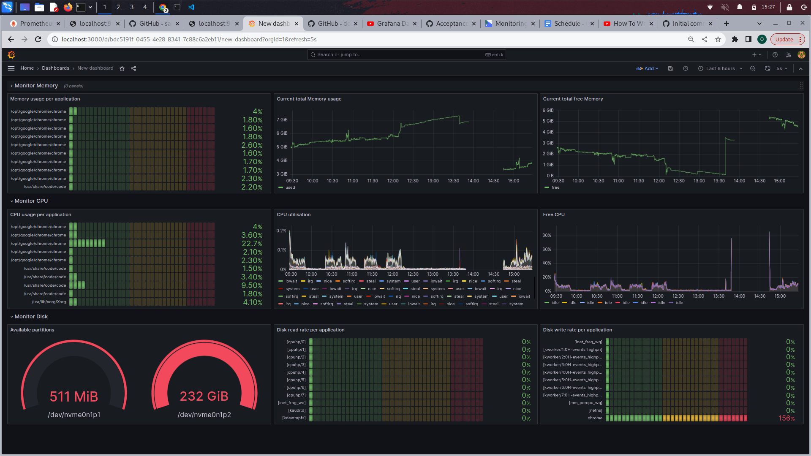

<a name="readme-top"></a>

<!-- PROJECT LOGO -->
<br />
<div align="center">
  <a href="https://github.com/othneildrew/Best-README-Template">
    
  </a>

  <h3 align="center">System activity monitor</h3>
</div>

<!-- TABLE OF CONTENTS -->
<details>
  <summary>Table of Contents</summary>
  <ol>
    <li>
      <a href="#about-the-project">About The Project</a>
      <ul>
        <li><a href="built-with">Built With</a></li>
      </ul>
    </li>
    <li>
      <a href="#terminal">Real-time Statistics Display via terminal</a>
      <ul>
        <li><a href="#goals1">Goals</a></li>
        <li><a href="#structure1">Structure</a></li>
        <li><a href="#dependencies1">Dependencies</a></li>
        <li><a href="#run1">Detailed Build and Run Instructions</a></li>
        <li><a href="#demo1">Demonstration</a></li>
      </ul>
    </li>
    <li>
      <a href="#prometheus-grafana">Real-time Statistics Display via Prometheus-grafana</a>
      <ul>
        <li><a href="#setup">Full setup</a></li>
        <li><a href="#startPro">start prometheus-grafana</a></li>
        <li><a href="#grab">Let's grab some system metrics (memory, CPU, disk)</a></li>
        <li><a href="#demo2">Demonstration</a></li>
      </ul>
    </li>
  
  </ol>
</details>

<a href="#about-the-project"></a>

<!-- ABOUT THE PROJECT -->

<a name="readme-top"></a>

## About The Project

Welcome to the System Monitor project - a powerful tool designed to provide real-time insights into your Linux system's performance. This project embraces the principles of object-oriented programming  plus the integration of Grafana and Prometheus, in order to deliver an intuitive and informative system monitoring experience similar to the htop utility.

<a href="#built-with"></a>

### Built With

Languages and Tools used to build this project include 

[](https://skillicons.dev)

<p align="right">(<a href="#readme-top">back to top</a>)</p>

<!-- Terminal project -->

<a href="#terminal"></a>

## Real-time Statistics Display via terminal


In this phase of the project, we aimed to create a Grafana dashboard for our System Activity Monitor. To achieve this, we harnessed the power of Prometheus as our data source, which provides robust and efficient monitoring capabilities. Additionally, we integrated Node Exporter, a tool that collects essential system metrics, and Pushgateway, which facilitates the exposition of metrics from non-Prometheus-native sources.


<a href="#goals1"></a>


### Goals

The primary objective of this project is to employ object-oriented programming to create a Linux system monitor similar to htop. Additionally, we implemented a feature for real-time updates.

<a href="#structure1"></a>


### Structure

The project is structured into various files, with header files located in the "include" folder.

├── terminal/\
│ ├── src/\
│ │ ├── main.cpp\
│ │ ├── format.cpp\
│ │ ├── ncurses_display.cpp\
│ │ ├── linux_parser.cpp\
│ │ ├── system.cpp\
│ │ ├── process.cpp\
│ │ └── processor.cpp\
│ ├── include/\
│ │ ├── format.h\
│ │ ├── ncurses_display.h\
│ │ ├── linux_parser.h\
│ │ ├── system.h\
│ │ ├── process.h\
│ │ ├── disk_info.h\
│ │ ├── process_io_info.h\
│ ├── CMakeLists.txt/\
│ ├── Makefile/\

1. `src/main.cpp`: This file acts as the entry point, coordinating the system and ncurses logic.

2. `src/format.cpp` (and corresponding header file): Contains functions for string formatting, including time format adjustments.

3. `src/ncurses_display.cpp` (and corresponding header file): Handles the functionality responsible for displaying results in the terminal using ncurses.


4. `src/linux_parser.cpp` (and corresponding header file): This section contains functions dedicated to reading data from the Linux file system.


5. `src/system.cpp` (and corresponding header file): Implements the "System" class, which encapsulates system data and relevant logic.


6.  `src/process.cpp` (and corresponding header file): Includes the "Process" class, managing process-related data and logic. 


7.  `src/processor.cpp` (and corresponding header file): Provides the "Processor" class, which handles processor-related data and logic.


<a href="#dependencies1"></a>


### Dependencies

The successful execution of this project relies on the following dependencies:
  
- Linux-based OS with Linux version 2.6 or higher.
- make >= 4.1 (Linux)
- cmake >= 3.11.3
- GCC/G++ version 7.4.0 or newer.
- NCurses library for text-based graphical output in the terminal
  - Use `sudo apt install libncurses5-dev libncursesw5-dev` to install ncurses  


<a href="#run1"></a>

### Detailed Build and Run Instructions

1. Clone this repo.
2. Cd to terminal folder `cd terminal`.
3. Build configuration: `cmake.`
4. Build automation: `make`
5. Run generated file: `./monitor`

Note:

Please be aware that you might encounter some warnings in the code. To mitigate these potential issues, we have utilized C++17 standards, which are explicitly set in the configuration file located at .vscode/c_cpp_properties.json for Visual Studio Code.

<a href="#demo1"></a>


### Demonstration

Below is an exemplar output obtained from my Linux laptop:



The upper block displays CPU and memory utilization, along with a list of disk partitions and other valuable information. The second block provides CPU and memory usage per application, and finally, there is a section showing disk read and write rates per application.


<p align="right">(<a href="#readme-top">back to top</a>)</p>

<!-- Terminal project -->

<a href="#prometheus-grafana"></a>


## Real-time Statistics Display via Prometheus-grafana

In this phase of the project, we aimed to create a Grafana dashboard for our System Activity Monitor. To achieve this, we harnessed the power of Prometheus as our data source, which provides robust and efficient monitoring capabilities. Additionally, we integrated Node Exporter, a tool that collects essential system metrics, and Pushgateway, which facilitates the exposition of metrics from non-Prometheus-native sources.


### Full setup

When running locally with Docker, you can access the following services and their respective endpoints:

- Prometheus: http://localhost:9090
- Grafana: http://localhost:3000 (Username: demo / Password: demo)
- Node Exporter: http://localhost:9100/metrics
- pushgateway: http://localhost:9091/metrics

<a href="#startPro"></a>

### start prometheus-grafana

```sh
# Starts Prometheus
docker-compose up -d prometheus

# Starts system metrics exporter
docker-compose up -d node-exporter

# Starts pushgateway
docker-compose up -d pushgateway

# Starts grafana
docker-compose up -d grafana
```

To acquire data from non-Prometheus-native sources, we integrated Pushgateway. This allows us to collect valuable information related to CPU, disk, and memory per application. For this purpose, we developed four scripts that you need to execute. These scripts will ensure the accurate feeding of data into Pushgateway, enabling a comprehensive and reliable monitoring experience.

```sh
# Disk read rate per application
while sleep 1; do     ./disk-read ; done

# Disk write rate per application
while sleep 1; do     ./disk-write ; done

# CPU current usage per application
while sleep 1; do     ./cpu ; done

# Memory current usage per application
while sleep 1; do     ./memory ; done
```

Once you have completed the entire setup process, you will be able to effortlessly import the "dashboard.json" file into your Grafana dashboard. This step will seamlessly integrate the predefined dashboard configuration, allowing you to visualize and analyze the collected metrics with ease.

Note:

Don't forget to include Prometheus as the data source in your Grafana dashboard and ensure that you refresh each panel. By doing so, you'll establish a direct connection to Prometheus for fetching real-time data and ensure that all panels display the most up-to-date information.

### Let's grab some system metrics (memory, CPU, disk)

Below are the queries to retrieve all the essential metrics showcased on this dashboard. 

```sh
# Memory usage per application (based on script memory.sh)
topk(10, memory_usage)

# Current total memory usage
node_memory_MemTotal_bytes-node_memory_MemFree_bytes-node_memory_Cached_bytes-node_memory_Buffers_bytes

# Current total free memory
node_memory_MemFree_bytes

# CPU usage per application (based on script cpu.sh)
topk(10, cpu_usage)

# CPU utilisation
rate(node_cpu_seconds_total{mode!="idle"}[1m])

# Free CPU
100 - rate(node_cpu_seconds_total{mode="idle"}[1m]) * 100

# Available partitions

node_filesystem_size_bytes{device!~"tmpfs", mountpoint!~"/etc/hostname|/etc/resolv.conf|/etc/hosts"}

# Disk read rate per application (based on script disk-read.sh)
topk(10,disk_read)


# Disk write rate per application (based on script disk-write.sh)
topk(10,disk_write)
```


### Demonstration

Below is my dashboard in grafana



<p align="right">(<a href="#readme-top">back to top</a>)</p>

